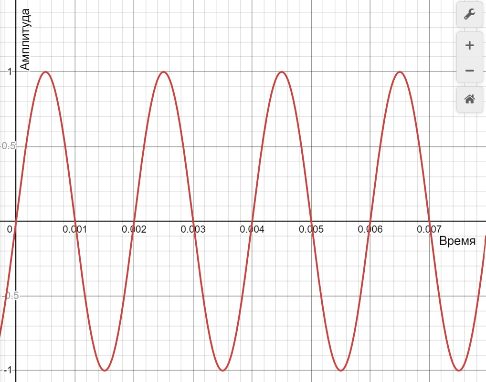
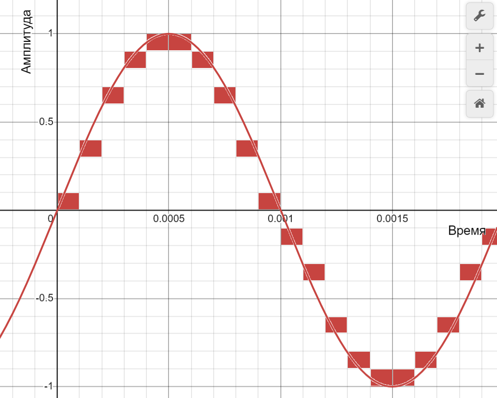
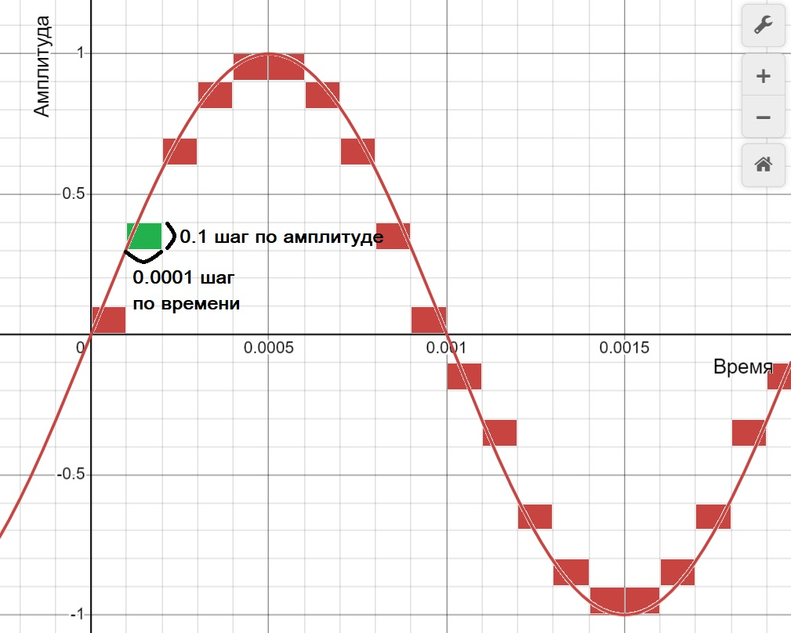
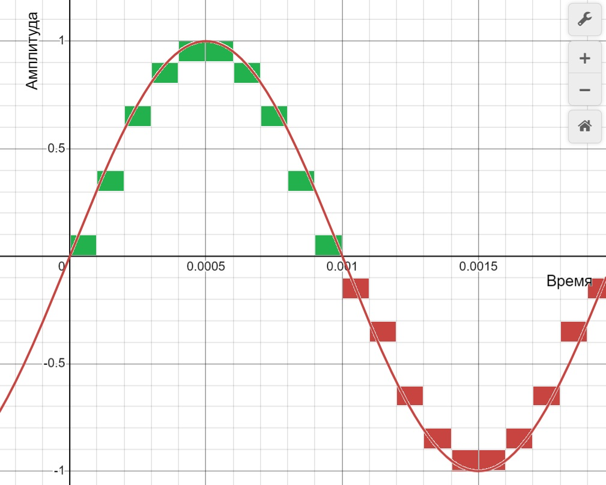
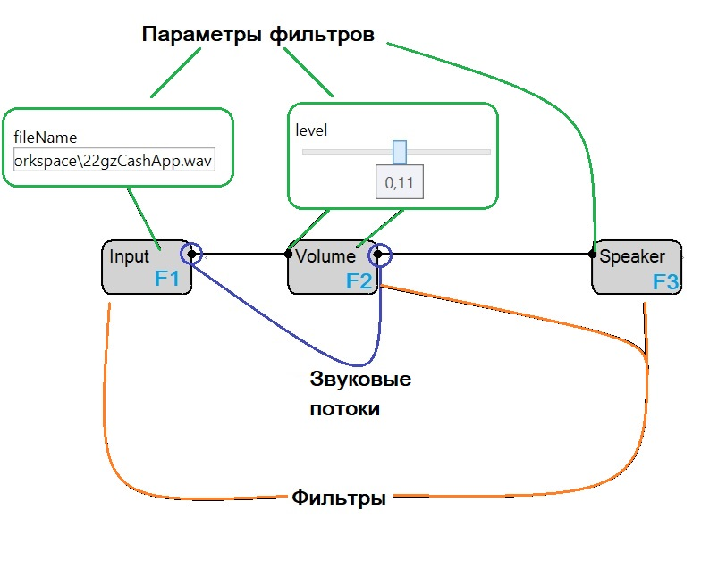
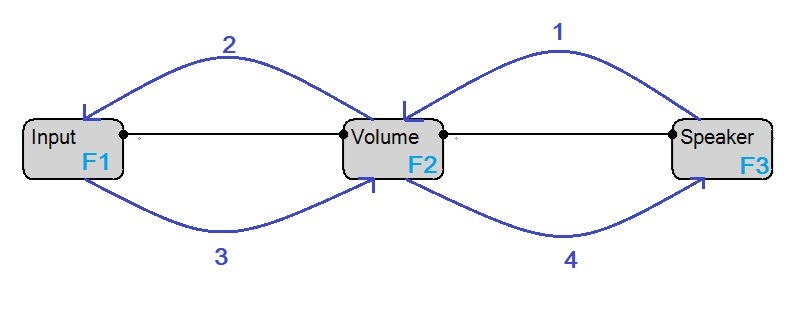

# Принцип работы
### Основы цифрового звука
Звук в цифровых системах принято представлять как нечто дискретное.\
Для примера рассмотрим звук комара, который машет крыльями 1000 раз в секунду. Если изобразить звук, который он будет таким образом производить, то получим следующее:\

По итогу мы будем слышать звук частотой 1000Гц.\
Однако график выше - аналоговый. Иными словами - непрерывный поток информации, который можно беспрепятственно масштабировать как по оси времени (X), так и по оси амплитуды (Y), и при этом получать все более точные значения.\
Такой тип информации свойственен окружающего миру, и невозможен в представлении цифровой техники.\
В цифровом мире аналоговые сигналы принято аппроксимировать с заданной точностью. Иными словами, давайте разобьем каждую ось делениями заданного размера.\

В данном примере мы аппроксимировали исходную волну конечным количеством замеров (красные квадраты). Каждый такой замер принято называть семплом. Отметим, что у семпла есть размерность - ширина (его длительность по времени, в данном примере 0.001сек) и глубина (количество различимых замеров по амплитуде (от -1 до 1), в данном случае 20).\
\
В Современном мире принято множество вариантов размерностей семпла, но самый распространенный это шаг $$\frac{1}{65536}$$ по амплитуде и $$\frac{1}{44100}$$ по времени. Такая размерность дает очень качественный звук, и среднестатистический человек не способен отличить его от аналогового.

### Основные термины в проекте
- **Семпл**\
Мельчайшая единица звука. Фактически являет собой замер состояния мембраны в определенный момент времени. Содержит в себе два числа, для левого и правого канала звука (от -1 до 1 каждое) - отклонение мембраны, иными словами - относительную амплитуду.\
Один из семплов изображен зеленым (его можно записать как <3,1> (индекс по амплитуде, затем индекс по времени)) -

- **Чанк**\
Последовательность семплов одинаковой размерности - это чанк. Чанк можно воспроизвести. Фактически для любого звука можно создать чанк его аппроксимирующий.\
Чанк длительностью 0.001 секунды -

- **Звуковой поток**\
Механизм позволяющий фильтру запрашивать чанки с другого фильтра.
- **Параметры фильтра**\
Набор значений для инициализации фильтра, а также еще один набор динамических значений (для модификации во время работы фильтра).
- **Фильтр**\
Блок, определенным образом генерирующий, обрабатыващий или потребляющий звуковые потоки. Если блок не является потребителем (как, например, блок динамика), то он также и сам является звуковым потоком.

### Пример простой схемы

На схеме представлены 3 фильтра:
* Input - входной файл\
Фильтр имеет один инициализирующий параметр - имя входного файла. Является звуковым потоком предоставляя через него чанки считанного файла.
* Volume - изменение громкости\
Фильтр имеет два параметра - уровень громкости (динамический параметр) и звуковой поток чей уровень громкости нужно поменять. Сам фильтр является звуковым потоком предоставляя через него чанки входного потока с измененной громкостью.
* Speaker - воспроизведение потока\
Фильтр имеет один инициализирующий параметр - звуковой поток который необходимо воспроизвести. Сам фильтр звуковым потоком не является.

### Принцип передачи чанков по звуковым потокам
В общем процесс передачи чанков можно описать следующим образом -

1. Speaker начинает воспроизведение. Для воспроизведения запрашивает очередной чанк (для примера размерности 2 секунды) у своего параметра звукового потока (на данной схеме это Volume).
2. Volume получает запрос на чанк, и в свою очередь обращается за чанком к фильтру который к нему подключен - Input.
3. Input получает запрос на чанк. Сам Input не зависит ни от каких звуковых потоков (как это видно на схеме). Input считывает данные с файла и возвращает их по запросу фильтру Volume.
4. Volume получив запрошенный чанк, применяет к нему фильтр громкости и передает дальше в ответ на запрос от Speaker
5. Speaker получив запрошенный на шаге 1 чанк воспроизводит его.

Заметим, что процесс повторится и для следующей порции данных которую запросит Speaker.\
Такие блоки как Speaker будем называть потребителями, т.к. сами они не являют собой звуковой поток и запускают цепочку обработки.

### Реализация
Проект состоит из 7 частей, 5 из которых проекты и 2 - дополнительные материалы.
* SP.Domain\
Содержит основные сервисы для работы с фильтрами и звуковыми потоками.
  + `FiltersManager`\
  Сервис ответственный за коллекцию доступных фильтров. Самостоятельно загружает фильтры из файлов dll в заданной папке. Позволяет проинициализировать произвольный блок фильтра, перечислить доступные типы фильтров.
  + `ShemeConstructor`\
  Класс конструктора схемы. Может создать пустую схему и добавлять туда произвольные фильтры, задавать им зависимости и настраивать параметры. После формирования схемы способен запустить симуляцию и вернуть класс симуляции - PipeSheme.
  + `PipeSheme`\
  Класс запущенной симуляции. Может устанавливать и считывать динамические параметры фильтров схемы, а также способен остановить симуляцию.
  + `FilterNode`\
  Класс фильтра схемы при его сохранении в файл. Содержит Id, Id фильтра, зависимости (связи звуковых потоков и параметры запуска) а также мета-информацию (для UI это X и Y координаты на схеме). Пример -
  ```
  {
    "Filter": {
      "Id": "72f6cd98-0fec-4722-94da-1b27e0939499",
      "Type": "Input",
      "Parameters": [
        "C:\\Users\\Eax\\Desktop\\MAI\\DIPL\\Experiments\\Workspace\\22gzCashApp.wav"
      ]
    },
    "Meta": {
      "X": 164,
      "Y": 267,
      "Label": "Input",
      "Color": "#FF000000"
    }
  }
  ```
  
  + `ShemeManager`\
  Сервис ответственный за чтение/сохранение ShemeConstructor из файла (хранение происходит посредством json из массива FilterNode).

* SP.SDK\
Содержит основные модели и интерфейсы для создания фильтров. Являет собой некоторое API.
  + `ISoundProvider`\
  Интерфейс звукового потока. Имеет метод `SoundData ReadPart(int length)` для чтения очередного чанка.
  + `ISoundFilter`\
  Интерфейс фильтра. Имеет метод для инициализации фильтра инициирующими параметрами, а также методы для чтения/записи динамических параметров. Поддерживает деструктор.
  + `IFilterEntry`\
  Интерфейс описания фильтра. Содержит имя фильтра, описание, ссылку на исходный код. Задает типы параметров (как инициирующих, так и динамических) а также их значения по умолчанию и их режим (чтение/запись, только запись, только чтение). А также возвращает конкретный привязаный ISoundFilter.
  + `Primitives`\
  Содержит звуковык примитивы, такие как Sample, SoundData (чанк). Также содержит типы параметров. На данный момент доступны следующие типы -
    - _DynamicAction_\
    Тип действия. Может быть только для записи. Визуально выглядит как кнопка, при нажатии которой фильтр получает сигнал (отдельный сигнал о нажатии и отдельный сигнал для отпускания).
    - _DynamicEnum_\
    Тип перечисления. Визуально выглядит как выпадающий список. Можно встретить у фильтра Speaker. При изменении значения фильтр получает сигнал с новым значением.
    - _DynamicFloat_\
    Тип вещественного числа. Визуально выглядит как ползунок. Можно встретить у фильтра Volume. При изменении значения фильтр получает сигнал с новым значением.
    - _DynamicImage_\
    Тип изображения. Визуально выглядит как картинка фиксированного размера. Может быть только для чтения. При запросе следующего кадра, фильтр получает команду на генерацию изображения.
    - _DynamicInt_\
    Тип целого числа. Визуально выглядит как ползунок. При изменении значения фильтр получает сигнал с новым значением.
    - _DynamicStream_\
    Тип звукового потока. Визуально выглядит как связи между фильтрами. Может быть задан только на этапе инициализации.
    - _DynamicString_\
    Тип строки. Визуально выглядит как поле ввода. Можно встретить у фильтра Input. Может работать как на чтение, так и на запись. При изменении значения фильтр получает сигнал с обновленным значением.
  + `Structures`\
  Содержит основные вспомогательные структуры данных для обработки звука -
    - _SoundQueue_\
    Структура звуковой "трубы" по принципу FIFO. Поддерживает операции записи и чтения чанков произвольной длины.
* SP.UI\
Содержит основные сервисы и модели для графического интерфейса приложения.
  - _Components_\
  Содержит основные крупные компоненты интерфейса. А именно - компонент схемы (GraphViewer), параметров (PropertiesStore) и строки состояния (StatusBar).
  - _Resources_\
  Содержит изображения для документации а также архив с фильтрами которые будут установлены по умолчанию.
  - _Services_\
  Содержит сервисы для конвертации схемы в представление UI компонента схемы, сервис контекстного меню, настроек, конвертации множества параметров в представление компонента параметров.
  - _Utils_\
  Содержит различные методы преобразования примитивов типа цветов, координат.
  - _ViewModels/View_\
  Содержит представления и модели для экранов настроек, основной панели, панели плагинов, документации.
* SP.Worker\
Использование инструмента также допускается и без графического интерфейса. Он может быть интегрирован в произвольный проект для выполнения задачи обработки звука. Пример такой интеграции для консольного приложения описан в данном проекте, а точнее  в файле `ConsoleWorker.cs`
* SP.Installer\
Представляет собой проект установщика приложения. Именно с его помощью сгенерирован файл `SP.Installer.msi` в корне репозитория.
* SP.Filters\
Содержит исходный код всех плагинов (фильтров) в приложении. К примеру таких как Input, Volume, Speaker и многих других.
* SP.Samples\
Содержит различные примеры файлов схем для ознакомления. Их можно скачать и запустить через приложение SoundPipe.

### Точка входа
Подробнее изучить работу приложения можно начав с метода `OpenShemeFromFile` в проекте `SP.UI`.
