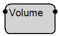
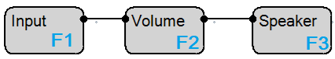
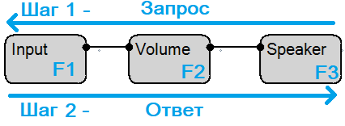
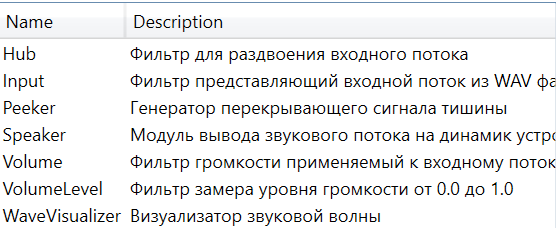

# Как пользоваться

Данный инструмент - интерактивный конструктор звукового графа. С его помощью можно строить схемы состоящие из различных блоков фильтров связанных между собой.

Основной упор был сделан на понятность процесса обработки звука и простоту использования инструмента, чтобы им было удобно пользоваться даже новичку.

В общем, чтобы начать пользоваться инструментом, нужно иметь представление о нескольких понятиях:

1. **Фильтр**

   Фильтр - строительный кирпич в схеме. Схемы состоят из множества фильтров, связанных между собой. Помимо связей с другими фильтрами, фильтр может иметь множество настраиваемых параметров.

   Для примера рассмотрим фильтр громкости:

   

   У этого фильтра две связи (одна входная - слева, и одна исходящая - справа). Это значит, что фильтру нужен один входной звуковой поток (тот, чью громкость он будет изменять). Результат работы этого фильтра - исходящий поток (уже с измененной громкостью).

   Также отметим, что у фильтра есть параметры. Они бывают двух видов - параметры запуска и параметры симуляции.

   

   Для добавления фильтра на схему нажмите правой кнопкой мыши на пустой области схемы. Для удаления/переименования фильтра нажмите правой кнопкой мыши на блоке фильтра на схеме.

2. **Схема**

   Схема - это множество соединенных между собой фильтров. Пример:

   

   Тут представлена простая схема из трех фильтров: фильтр входного файла (F1), фильтр громкости (F2) и фильтра воспроизведения (F3).

   В плане работы схемы - она работает от потребителя (фильтр только с входной связью) к источнику. Другими словами, F3 (являясь фильтром потребителем) запрашивает звуковые данные у источника (в его случае это F2). F2 запрашивает данные у подключенного к нему фильтра F1. F1 в свою очередь считывает очередную порцию данных из файла и возвращает их в ответ на запрос от F2. F2 применяет коррекцию громкости к поступившим данным и передает их дальше фильтру F3. F3 получив данные на свой запрос их воспроизводит. Заметим, что данный запрос может быть повторен для следующей порции данных (тут порция данных -  некая длительность звуковых данных). Иными словами, можно сказать что запрос данных происходит справа налево, в то время как ответ - слева направо.

   

   Отметим, что схема - это необязательно одна цепочка фильтров. Она может содержать ветвления (например фильтр "Add", который имеет две входные связи и суммирует звуковые потоки, или фильтр "Hub", который напротив, имеет две выходные связи, клонируя входной поток надвое).\
   После настройки схемы ее можно сохранить в файл используя меню "Файл".

3. **Симуляция**

   Изначально во время проектирования схемы (т.е. во время расстановки фильтров, их соединении, настройки их параметров) схема находится в режиме конструктора. Чтобы запустить схему (запустить фильтры) нужно запустить симуляцию. Фактически, описанный выше процесс запрос - ответ происходит именно в режиме симуляции.\
   \
   Для запуска/остановки схемы можно воспользоваться соответствующими пунктами в меню "Схема".\
   \
   Как было отмечено ранее, во время запущенной симуляции фильтры имеют другое множество параметров. К примеру, фильтр входного файла в режиме конструктора имеет параметр имени входного файла, в то время как в режиме симуляции параметров не имеет. А вот фильтр анализатора звука напротив - не имеет параметров в режиме конструктора, но имеет параметр выходного изображения в режиме симуляции. Также отметим фильтр громкости, который имеет параметр множителя громкости входного потока как в режиме конструктора, так и в режиме симуляции.\
   \
   Отметим, что параметры у фильтров могут быть разных типов - строка (как у фильтра входного файла), вещественное число (как у фильтра громкости), вариант из списка, изображение или кнопка.

4. **Пример схемы**

   Для ознакомления создадим простую схему для изменения громкости входного потока:

   1. Добавим три фильтра с помощью правого клика мышью (входной файл, громкость, динамик).
   
   
   
   2. Соединим их как на картинке выше.
   
   3. Настроим фильтр входного файла - нажмите на него левой кнопкой мыши, в панели справа будет отображен список параметров. Задайте в параметр fileName путь к wav файлу на диске.
   
   4. Запустите схему через меню "Схема".
   
   5. Перейдите к фильтру воспроизведения (Speaker) и задайте ему параметр state на значение play.
   
   6. Вы должны будете услышать воспроизведение файла, путь которого вы задавали ранее. Теперь вы можете перейти к параметрам фильтра Volume и в реальном времени менять его параметр громкости.

5. **Плагины**

   Отметим, что данное приложение является модульным, и имеет возможность расширения с помощью плагинов фильтров.

   Установить сторонний плагин можно через меню "Плагины".

   

   Прочитать больше о разработке собственного плагина можно в [технической документации](./CreatePlugin.md) приложения.
