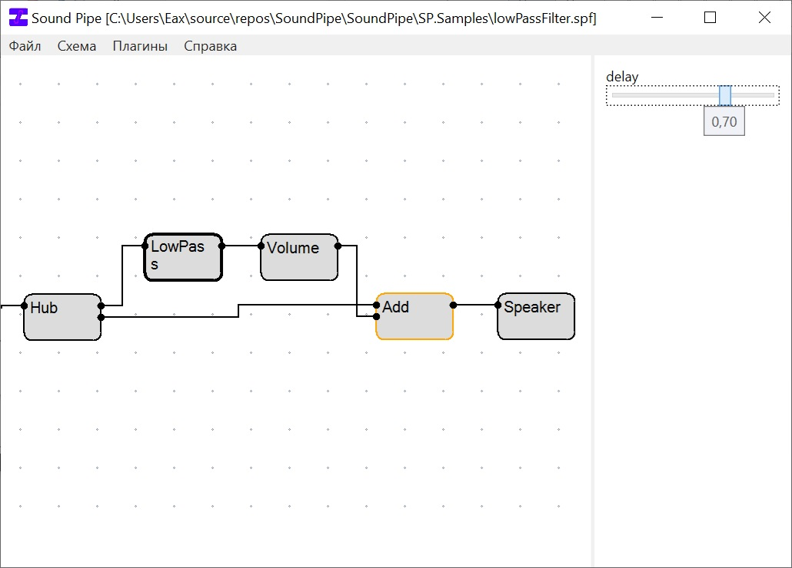

# SoundPipe
**Constructor of sound stream processing graphs**\
**Конструктор графа звуковой обработки**

### О проекте
Данное приложение позволяет в интерактивном режиме строить блок схемы обработки звука, а также запускать на их основе симуляции. Сами блоки являются модульной частью, всегда можно скачать новые или даже создать свои.\
Изначальная цель - познакомить новичков с базовой обработкой звука.

#### Для пользователей
[Как установить](./Docs/Install.md)\
[Как пользоваться](./Docs/Usage.md)

#### Для разработчиков
[Принцип работы](./Docs/HowItWorks.md)\
[Как разработать собственный плагин](./Docs/CreatePlugin.md)
